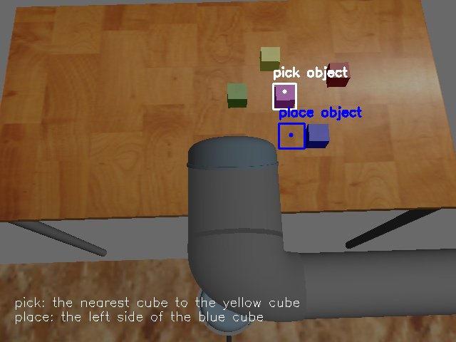
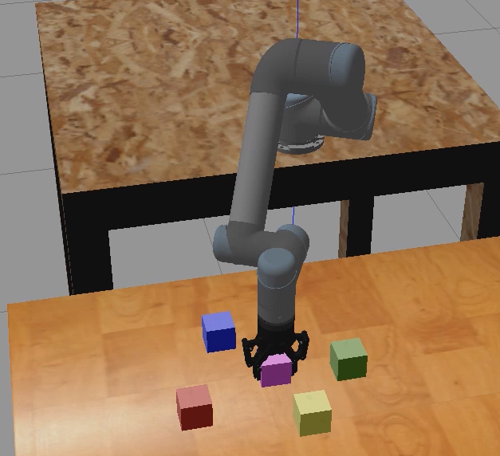

# RoboChat
A system is develpoed for generating action plans and code for a robot to perfrom a pick-and-place task that is stated in text and searches through the robot's workspace to localize the objects that are referred to in textual descriptions. 

For runnig the system, Azure account is needed, as the LLM and RAG is deployed on Azure AI Faundry. 
To start the system, run the `main.py` script located in `src/pipeline`.
To add new documents to the RAG system, add documents on Azure Storage and then run `index_docs_inAzure.py` located in `src/LLMs/RAG`.


> The result for Vision module to localize an image that is described in text (nearest cube to the yellow cube and left side of blue cube):



> The task (pick the nearest cube to the yellow cube and place it left to the blue cube.) preformed in simulation env:

>
>


The main script for running the project is `main\RoboChat\src\pipeline\main.py`


## VLM

#### example for dataset for fintuning a VLM model
[Aquarium_Dataset](https://huggingface.co/datasets/EduardoPacheco/aquarium/viewer/default/train?row=10)
> 448 samples only for training, containing BB for each object in the image, array of numerical label like `[0, 4]`, array for textual label `["fish", "shark"]`


## LLMs

LLMs:
```shell
You are a ROS expert. Given an action and an object's position in JSON format, generate a Python ROS script for executing the action using MoveIt!.

JSON Input:
{
  "action": "pick",
  "object": "blue cube",
  "position": {
    "x": 0.35,
    "y": -0.12,
    "z": 0.25
  }
}

Output a complete Python ROS script.

```

### the parameters for definig LLM:
> **Parameters:** 
>  +  ***messages***=messages : a list of a converstation including user prompt, roles and retrived docs
>  + ***max_tokens***=800 : max words for generating the response
>  + ***temperature***=0.7 : controlling the randomness of the response; 1-1.5 more creative, 0.1-0.3 more determinstic and focused responces 
>  + ***top_p***=0.95 : Controls the probability mass of token choices. Instead of considering all possible words, the model only picks from a subset whose cumulative probability is 0.95, so the model has a diverse output. On the contrary, lower values, like 0.5 makes the model to pick from a more restricted set, making responses more deterministic.
>  + ***frequency_penalty***=0 : Adjusts the model’s tendency to repeat words. higher values (1-2) reduce the repetition but 0 or negative velues allows repetition.
>  + ***presence_penalty***=0 : Encourages the model to introduce new words that haven't appeared before
>  + ***stop***=None : Defines a sequence of characters that will stop the model from generating further text. If None, the model generates up to max_tokens. Example: stop=["\n\n"] would stop the generation at a double newline.
>  + ***stream***=False : Controls whether the response is streamed in real time.

```py
completion = client.chat.completions.create(  
    model=deployment,
    messages=messages,
    max_tokens=800, 
    temperature=0.7, 
    top_p=0.95,  
    frequency_penalty=0,  
    presence_penalty=0,
    stop=None,  
    stream=False
)
```


giving the object position to LLM:
```py
import openai
import json

# Define the JSON input
position_data = {
    "action": "pick",
    "object": "blue cube",
    "position": {
        "x": 0.35,
        "y": -0.12,
        "z": 0.25
    }
}

# Call the LLM API
response = openai.ChatCompletion.create(
    model="gpt-4-turbo",
    messages=[
        {"role": "system", "content": "You are an expert in ROS and Python programming."},
        {"role": "user", "content": "Generate a ROS MoveIt! script based on this JSON input."},
        {"role": "user", "content": json.dumps(position_data)}
    ]
)

# Extract and print the generated code
ros_code = response["choices"][0]["message"]["content"]
print(ros_code)
```


```py
query_text = """
{
  "action": "pick",
  "object": "blue cube",
  "position": { "x": 0.35, "y": -0.12, "z": 0.25 }
}
"""

llm_prompt = f"""
You are a ROS expert. Given an action, object, and its position in JSON format, generate a Python ROS MoveIt! script.

### JSON Input:
{query_text}

### Similar ROS Code Snippets:
{retrieved_code_text}

### Generate a Python ROS Script:
"""

response = openai.ChatCompletion.create(
    engine="YOUR_AZURE_LLAMA_DEPLOYMENT",
    messages=[
        {"role": "system", "content": "You are an expert in ROS programming."},
        {"role": "user", "content": llm_prompt}
    ]
)
```

### Add chat history to the prompt
```
system: 
* Given the following conversation history and the users next question,rephrase the question to be a stand alone question.
If the conversation is irrelevant or empty, just restate the original question.
Do not add more details than necessary to the question.

chat history: 
 
user: 
{{ item.inputs.chat_input }} 
assistant: 
{{ item.outputs.output }} 


Follow up Input: {{ chat_input }} 
Standalone Question:
```


Vector queries that include a text-to-vector conversion step must use the same embedding model that was used during indexing. The search engine doesn't throw an error if you use different models, but you get poor results

To meet the same-model requirement, choose `embedding models` that can be referenced through `skills` during indexing and through `vectorizers` during `query execution.`

`Embeddings-ViT-Giant`


chatbot in Azure:
https://www.youtube.com/watch?v=fQ9RFR1KTbY&t=599s

### Azure useful pages for the project
[rg_thesis_west_2025 home page](https://portal.azure.com/#@knightec.onmicrosoft.com/resource/subscriptions/9005fcbc-4b58-41b4-b10d-d717ac772764/resourceGroups/rg_thesis_west_2025/overview)

[gpt-4o task-spliter LLM](https://ai.azure.com/playground/chat?wsid=/subscriptions/9005fcbc-4b58-41b4-b10d-d717ac772764/resourceGroups/rg_thesis_west_2025/providers/Microsoft.MachineLearningServices/workspaces/shiva_thesis_2025&tid=d4e58be1-01de-42ac-8628-91c6aaca7049&deploymentId=/subscriptions/9005fcbc-4b58-41b4-b10d-d717ac772764/resourceGroups/rg_thesis_west_2025/providers/Microsoft.MachineLearningServices/workspaces/ai_hub_thesis_west_2025/connections/aihubthesiswes8755517667_aoai/deployments/gpt-4o)


[the description for LLM models](https://learn.microsoft.com/en-us/azure/ai-services/openai/concepts/models?tabs=datazone-provisioned-managed%2Cstandard-chat-completions#assistants-preview)

[code interpretor](https://learn.microsoft.com/en-us/azure/ai-services/openai/how-to/code-interpreter?tabs=python)

[Azure OpenAI Assistants file search tool-python](https://learn.microsoft.com/en-us/azure/ai-services/openai/how-to/file-search?tabs=python)

[data retrival](https://learn.microsoft.com/en-us/azure/ai-studio/tutorials/copilot-sdk-build-rag)

[RAG in Azure](https://learn.microsoft.com/en-us/azure/search/tutorial-rag-build-solution)
  [search and generate answers](https://learn.microsoft.com/en-us/azure/search/tutorial-rag-build-solution-query)

  [first step - choose models](https://learn.microsoft.com/en-us/azure/search/tutorial-rag-build-solution-models)

  [tutorial for searching through docs using Azure AI search](https://github.com/HoussemDellai/ai-course/blob/1864185cf06f5918d7a556a87e2abe2dffc4bf9a/100_rag_intro/rag-demo.ipynb)

[RAG with Langchain - llama](https://www.youtube.com/watch?v=aD-u0gl93wM)
[RAG with Langchain - GPT](https://www.youtube.com/watch?v=AAMJZTEH_h4&t=244s)
[Langchain page for RAG and code correction](https://langchain-ai.github.io/langgraph/tutorials/code_assistant/langgraph_code_assistant/#graph)


> ***Using plain gpt-4o for generating code and action plan*** \
> "Query": "give me the code for picking the blue cube"
> action plan: 

> The action plan:
```
### **Action Sequence for Picking the Blue Cube:**
1. Identify the position of the blue cube using a vision system or hardcoded coordinates.
2. Move the UR5 robot's end effector to a "pre-grasp" position above the blue cube.
3. Move the end effector down to the "grasp" position to grab the cube.
4. Close the gripper to securely hold the cube.
5. Lift the cube by moving the end effector back to the "pre-grasp" position.
6. Optionally, move the cube to a target location.
```

> The generated code

```py
import rospy
import moveit_commander
from geometry_msgs.msg import Pose
from std_msgs.msg import String

# Initialize the moveit_commander
moveit_commander.roscpp_initialize([])
rospy.init_node('pick_blue_cube', anonymous=True)

# Initialize MoveGroupCommander for the UR5 arm and gripper
arm_group = moveit_commander.MoveGroupCommander("manipulator")
gripper_group = moveit_commander.MoveGroupCommander("gripper")

# Function to move the arm to a target pose
def move_to_pose(target_pose):
    arm_group.set_pose_target(target_pose)
    arm_group.go(wait=True)
    arm_group.stop()
    arm_group.clear_pose_targets()

# Function to control the gripper
def control_gripper(open_gripper):
    if open_gripper:
        gripper_group.set_named_target("open")
    else:
        gripper_group.set_named_target("closed")
    gripper_group.go(wait=True)

# Main function
def pick_blue_cube():
    # Step 1: Define the position of the blue cube (hardcoded example)
    blue_cube_pose = Pose()
    blue_cube_pose.position.x = 0.5  # Adjust with actual coordinates
    blue_cube_pose.position.y = 0.0
    blue_cube_pose.position.z = 0.2  # Pre-grasp height
    blue_cube_pose.orientation.x = 0.0
    blue_cube_pose.orientation.y = 1.0
    blue_cube_pose.orientation.z = 0.0
    blue_cube_pose.orientation.w = 0.0

    # Step 2: Move to the pre-grasp position
    rospy.loginfo("Moving to pre-grasp position...")
    move_to_pose(blue_cube_pose)

    # Step 3: Move down to the grasp position
    rospy.loginfo("Moving to grasp position...")
    blue_cube_pose.position.z = 0.1  # Adjust to the cube's surface height
    move_to_pose(blue_cube_pose)

    # Step 4: Close the gripper to grab the cube
    rospy.loginfo("Closing the gripper...")
    control_gripper(open_gripper=False)

    # Step 5: Lift the cube back to the pre-grasp position
    rospy.loginfo("Lifting the cube...")
    blue_cube_pose.position.z = 0.2  # Return to pre-grasp height
    move_to_pose(blue_cube_pose)

    rospy.loginfo("Blue cube picked successfully!")

if __name__ == "__main__":
    try:
        pick_blue_cube()
    except rospy.ROSInterruptException:
        print("fucked up")
```
